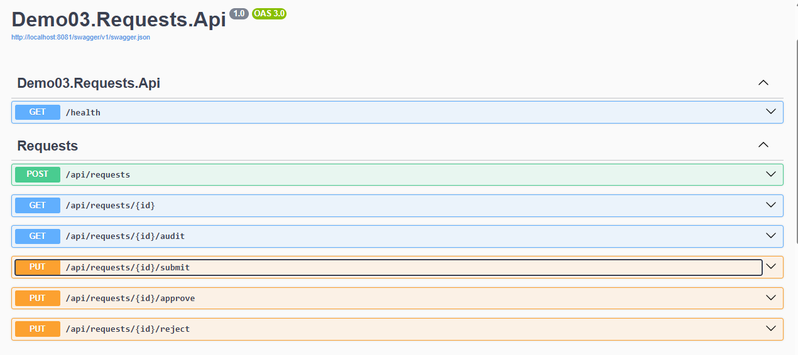
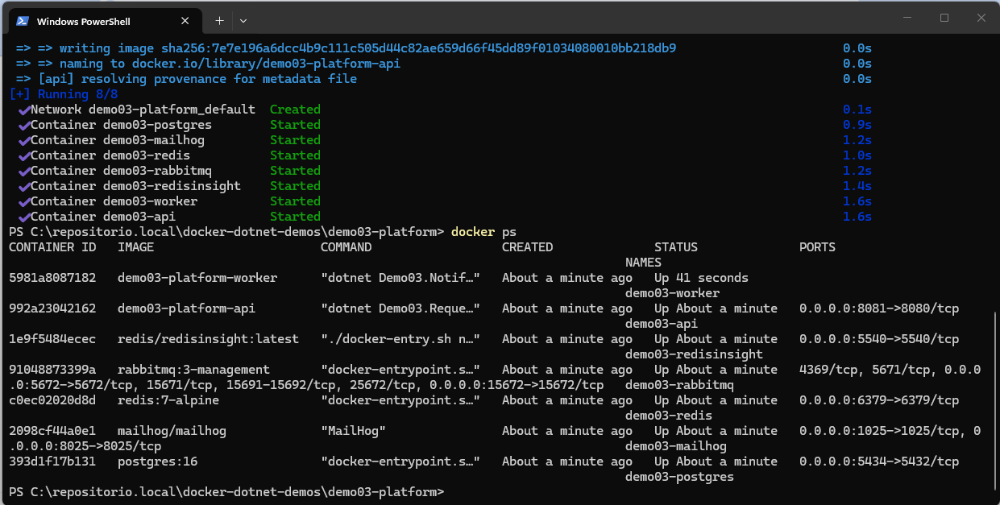
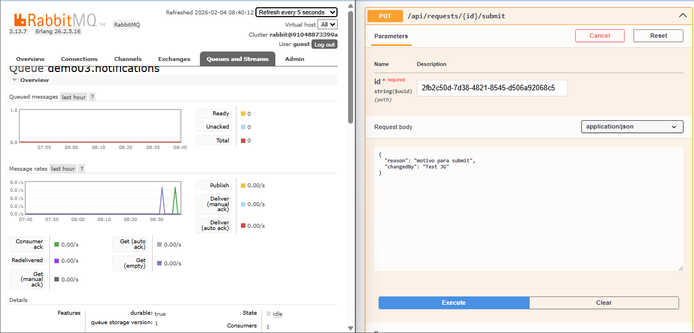
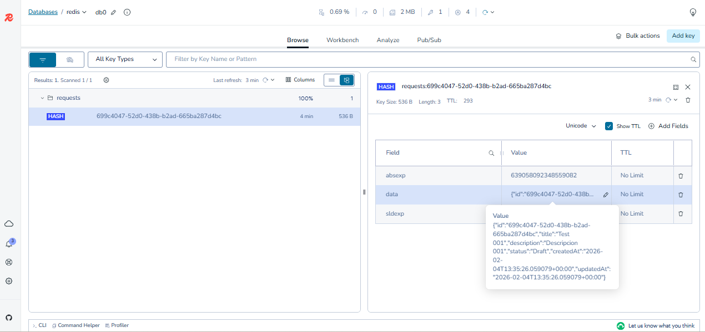
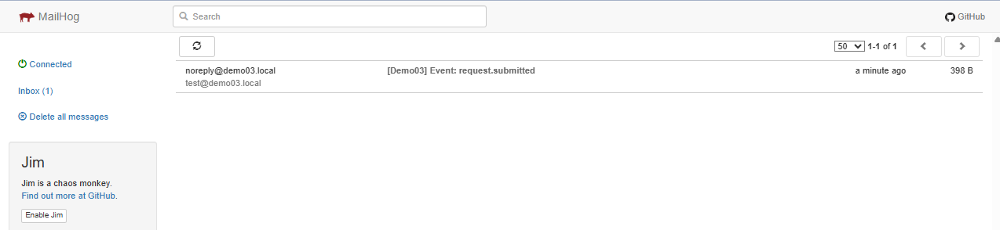

# Demo03 – Plataforma de Solicitudes Distribuida  
## (.NET 8 + DDD + Docker Compose)

## 📌 Contexto

Este proyecto forma parte de una serie de demos técnicas orientadas a demostrar **arquitectura de software moderna** sobre **.NET 8**, aplicando **Domain-Driven Design (DDD)**, **Clean Architecture**, **CQRS**, **event-driven architecture** y **12-Factor App**.

El foco principal del demo no es solo el código, sino **el diseño del dominio**, la separación de responsabilidades y el **despliegue reproducible de una solución distribuida completa** mediante **Docker Compose**.

---

## 🎯 Objetivo del demo

Demostrar dominio en:

- Modelado de dominio (DDD)
- Separación de responsabilidades por capas
- Arquitectura orientada a casos de uso
- Procesamiento síncrono y asíncrono
- Auditoría y trazabilidad de negocio
- Cache distribuido
- Mensajería y workers
- Despliegue profesional con Docker Compose

Este demo está pensado como **proyecto de portafolio para perfil Senior / Arquitecto de Software**.

---
## 🧠 Enfoque DDD aplicado

La solución está diseñada siguiendo principios de **Domain-Driven Design**, donde el **dominio es el núcleo del sistema** y **no depende de frameworks, infraestructura ni detalles técnicos**.

---

## 🧩 Alcance funcional

La plataforma modela un **flujo de solicitudes** con estados de negocio:

- Creada
- Enviada
- Aprobada
- Rechazada

Casos de uso implementados:

- Crear una solicitud
- Enviar una solicitud para aprobación
- Aprobar una solicitud
- Rechazar una solicitud
- Consultar una solicitud por ID
- Consultar el historial de auditoría de una solicitud

Cada transición de estado es gobernada por el **modelo de dominio** y genera un registro de auditoría.

---

## 🧱 Arquitectura general

La solución sigue **Clean Architecture**, separando capas y servicios:

```
API (HTTP)
├─ Controllers
├─ Middlewares
│   ├─ ExceptionHandling
│   └─ CorrelationId
├─ CompositionRoot
│   └─ DependencyInjection
├─ Swagger / OpenAPI
└─ UserContext (HttpUserContext)

Application
├─ UseCases
│   ├─ Commands
│   └─ Queries
├─ Contracts
│   ├─ Requests
│   │   ├─ CreateRequestDto
│   │   ├─ RequestDto
│   └─ Audit
│       └─ RequestAuditDto
├─ Abstractions
│   ├─ Repositories
│   ├─ Messaging
│   ├─ Caching
│   ├─ UserContext
│   └─ Auditing
├─ Auditing
│   └─ AuditHelper 
└─ DependencyInjection

Domain
├─ Entities
├─ Enums
└─ DomainEvents

Infrastructure
├─ Persistence
│   ├─ DbContext (EF Core)
│   ├─ Configurations
│   └─ Repositories
├─ Caching
│   └─ Redis
├─ Messaging
│   └─ RabbitMQ
├─ Auditing
│   └─ EfAuditWriter
└─ DependencyInjection

Worker
├─ Consumers
├─ EventHandlers
├─ Email
└─ Persistence (processed_events)

```

Las dependencias siguen la regla:

> **Las capas internas no dependen de las externas**

---

## 🔧 Decisiones técnicas aplicadas

### ✅ .NET 8
- ASP.NET Core Web API
- Worker independiente
- Hosting moderno con `Program.cs`

---

### ✅ CQRS
- **Commands**: Create, Submit, Approve, Reject
- **Queries**: GetById, GetAudit
- Lecturas optimizadas (`AsNoTracking`)
- Escrituras protegidas por reglas de dominio

---

### ✅ Auditoría (Audit Trail)
- Tabla dedicada `audit_logs`
- Registro de:
  - Estado previo
  - Estado nuevo
  - Actor
  - CorrelationId
  - Fecha UTC
  - Payload contextual (JSON)
- Implementada mediante `IAuditWriter`
- Consultable vía API

---

### ✅ CorrelationId y Actor Context
- Middleware `CorrelationIdMiddleware`
- Header `X-Correlation-Id`
- Contexto de usuario abstraído (`IUserContext`)
- Preparado para JWT / Identity
- CorrelationId propagado a:
  - logs
  - errores
  - auditoría

---

### ✅ Cache distribuido (Redis)
- Estrategia **Cache-Aside**
- Cacheo de `GET /requests/{id}`
- Invalidación automática en:
  - Create
  - Submit
  - Approve
  - Reject
- Implementado con `IDistributedCache`

---

### ✅ Event-Driven Architecture + Worker
- Publicación de eventos de dominio en **RabbitMQ**
- **Worker independiente** encargado de:
  - Consumir eventos
  - Ejecutar procesos asíncronos
  - Manejar side-effects (ej. envío de correos)
- Idempotencia garantizada mediante tabla `processed_events`

---

### 🗄️ Inicialización de la base de datos (Migraciones)

La creación del esquema de base de datos se gestiona mediante **migraciones de Entity Framework Core**.

> La base de datos es creada por el contenedor de PostgreSQL al iniciar el entorno.
> El esquema (tablas, índices y relaciones) se gestiona mediante migraciones aplicadas por la API.

---
## 🐳 Despliegue completo con Docker Compose (ENFOQUE PRINCIPAL)

La solución está diseñada para ejecutarse **completamente mediante Docker Compose**, levantando **toda la plataforma con un solo comando**, sin instalaciones locales adicionales.

```bash
docker compose up -d
```

---

### ✅ Servicios levantados automáticamente
- API (.NET 8)
- Worker (.NET 8)
- PostgreSQL
- Redis
- RabbitMQ
- MailHog (SMTP de pruebas)
- Todos los servicios:
  - Comparten una red interna Docker
  - Se comunican por nombre de servicio
  - Usan variables de entorno (.env)
  - Son independientes y escalables

---

### ✅ Filosofía de despliegue
El despliegue sigue principios 12-Factor App:

- Configuración externa
- Infraestructura declarativa
- Entornos reproducibles
- Sin dependencias locales del desarrollador
- Preparado para CI/CD y Cloud

Este enfoque permite ejecutar la plataforma de forma idéntica en:

- Local
- Integración continua
- Servidores on-premise
- Entornos cloud

---

### 📄 Documentación de la API

La API está documentada con **Swagger/OpenAPI**:

- SwaggerOperation con **Summary**
- Descripciones orientadas a negocio
- Códigos de respuesta explícitos

Acceso:
```bash
http://localhost:8080/swagger
```

---

### 🔍 Observabilidad y debugging

- Middleware centralizado de excepciones
- Respuestas de error estructuradas
- CorrelationId en errores y logs
- RabbitMQ Management UI
- RedisInsight para cache
- MailHog para ver correos procesados por el Worker

---

## 📸 Evidencia de ejecución

### Swagger – API en ejecución


### Docker Compose – Servicios levantados


### RabbitMQ – Mensajería y eventos


### Redis – Cache distribuido


### MailHog – Procesamiento asíncrono (Worker)

El siguiente correo fue generado por el **Worker** como resultado del consumo de un evento publicado por la API,
demostrando el flujo completo **API → RabbitMQ → Worker → Side-effect**.



> El envío de correos se realiza de forma asíncrona y desacoplada del flujo HTTP,
> garantizando que la API no dependa del resultado del side-effect.
---

### 🧭 Posibles extensiones

- Autenticación JWT
- Versionado de API
- Métricas y monitoring
- Tracing distribuido
- Pruebas de integración

---

## 👤 Autor
**Ricardo Jara Gaspar**  
Ingeniero de Software especializado en .NET y Arquitectura de Software  
🔗 [GitHub](https://github.com/RJARAG-92) · [LinkedIn](https://www.linkedin.com/in/ricardojarag) · 🇵🇪 Perú


